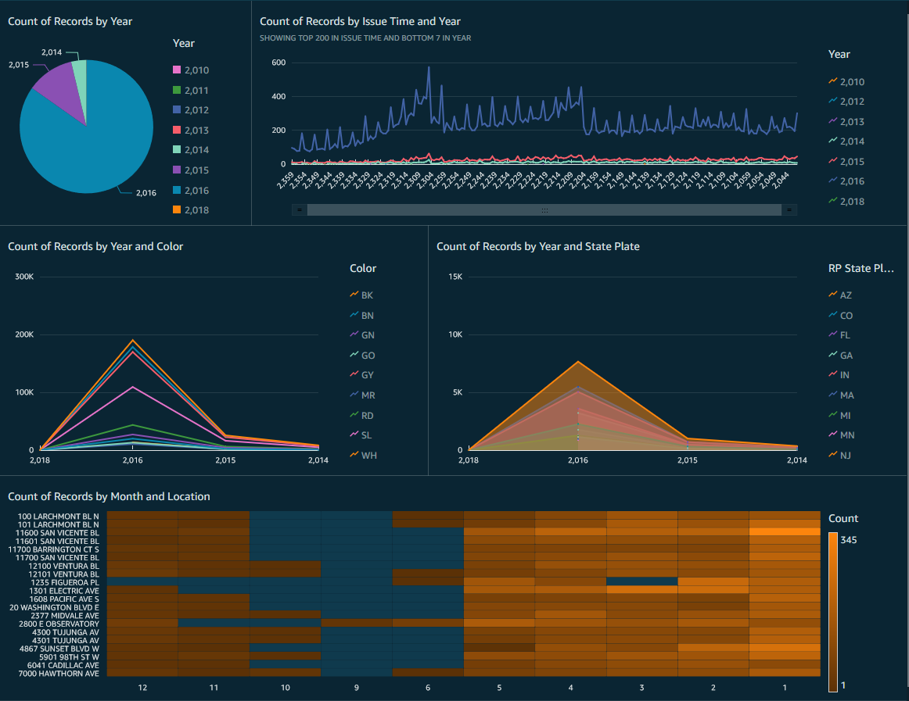

# Parking-Citations

## Initial DataSet 

At a glance we need to clean up some of the information in the doc. What immediately stands out is we should break down the issue date column and remove the 'Ticket number' column as we will not need it for our purposes.
  
|Ticket number|Issue Date|Issue Time|RP State Plate|Plate Expiry Date|Make|Body Style|Color|Location|Route|Agency|Violation Description|
|-------------|----------|:---------|--------------|-----------------|----|----------|-----|--------|-----|------|---------------------|
|1103341116   |12/21/2015|   1251   |      CA      |     200304      |HOND|    PA    | GY  |13147 W.|1521 |  1   |No eveidence of Reg  |  |1103700150   |12/21/2015|   1435   |      CA      |     201512      |GMC |    VN    | WH  |525 S Ma|1C51 |  1   |No eveidence of Reg  |
|1104803000   |12/21/2015|   2055   |      CA      |     201503      |NISS|    PA    | BK  |200 West|2R2  |  2   |No eveidence of Reg  |   

  

Once completed, we now have two seperate columns for 'Year/Month' and omit the day from 'Issue date' and 'Ticket number'. This serves two purposes as now the dataset itself is easier to wield and with our 'Year/Month' columns, we can break down information without being too granular and cluttering our dashboard. 
  
|Issue Time|RP State Plate|Plate Expiry Date|Make|Body Style|Color|Location|Route|Agency|Violation Description|Month|Year|
|----------|--------------|:----------------|---------------|-----|--------|-----|------|---------------|-----|-----|----|
|   1251   |      CA      |     200304      |HOND|    PA    | GY  |13147 W.|1521 |  1   |No eveidence of Reg  |  12 | 15 |   
|   1435   |      CA      |     201512      |GMC |    VN    | WH  |525 S Ma|1C51 |  1   |No eveidence of Reg  |  12 | 15 |

  

  

## What we learned.

From the initial pie chart we can see that 2014, 2015, 2016 were the most active with 2016 being the highest of the three.

 

Next from the line graph we can observe that during 2016 the most tickets cited were between the hours of 2200 and 2300. Below we can observe the top 5 most ticketed by color and the count of tickets issued to out of state vehicles. 

### Top 5 ticketed cars by color and by out of state in 2016:  
  
- Black
- White
- Gray
- Silver
- Red

### By Color: 

 

The adjacent area line chart tells us that the top 5 ticketd out of state cars in 2016 were: 

### By State: 

 
- AZ
- TX
- NV
- FL
- WA

And finally, we are able to determine what street issues the most tickets by month using a heatmap. What we can conclude is from January to May is when activity spikes and June through January shows a decline. We can also observe that 11600 San Vicente blvd had the ost tickets issued total in the month of January.
