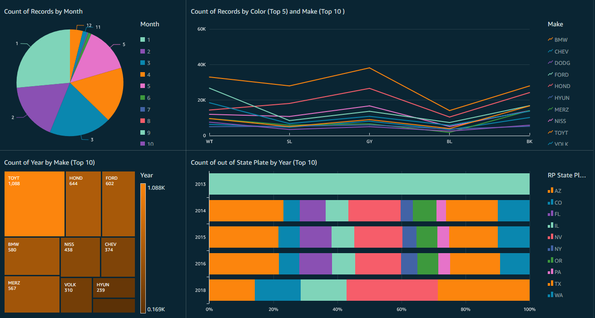

# Parking-Citations

|Ticket number|Issue Date|Issue Time|RP State Plate|Plate Expiry Date|Make|Body Style|Color|Location|Route|Agency|Violation Description|
|-------------|----------|:---------|--------------|-----------------|----|----------|-----|--------|-----|------|---------------------|
|1103341116   |12/21/2015|   1251   |      CA      |     200304      |HOND|    PA    | GY  |13147 W.|1521 |  1   |No eveidence of Reg  |  |1103700150   |12/21/2015|   1435   |      CA      |     201512      |GMC |    VN    | WH  |525 S Ma|1C51 |  1   |No eveidence of Reg  |
|1104803000   |12/21/2015|   2055   |      CA      |     201503      |NISS|    PA    | BK  |200 West|2R2  |  2   |No eveidence of Reg  |   

  

|Issue Time|RP State Plate|Plate Expiry Date|Make|Body Style|Color|Location|Route|Agency|Violation Description|Month|Year|
|----------|--------------|:----------------|---------------|-----|--------|-----|------|---------------|-----|-----|----|
|   1251   |      CA      |     200304      |HOND|    PA    | GY  |13147 W.|1521 |  1   |No eveidence of Reg  |  12 | 15 |   
|   1435   |      CA      |     201512      |GMC |    VN    | WH  |525 S Ma|1C51 |  1   |No eveidence of Reg  |  12 | 15 |

  

